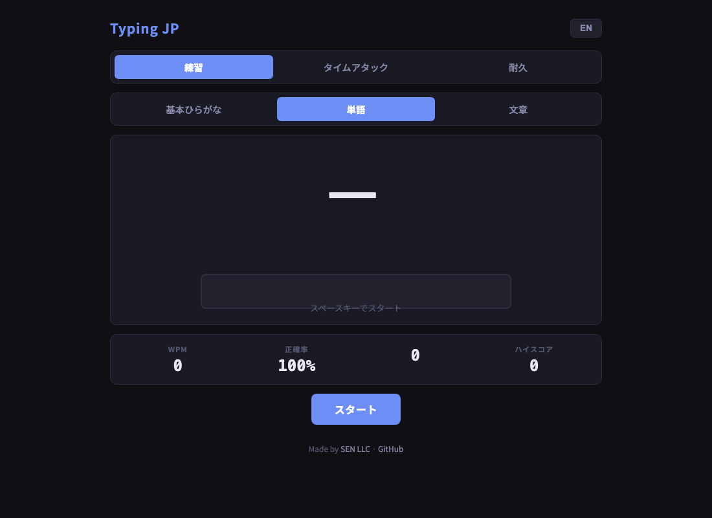

# Typing JP

[](https://sen.ltd/portfolio/typing-jp/)

日本語タイピング練習ゲーム。ひらがな → ローマ字入力、複数のローマ字表記に対応。

**Live demo**: https://sen.ltd/portfolio/typing-jp/



## 特徴

- Multiple romaji variants accepted (shi/si, tsu/tu, chi/ti, etc.)
- 3 modes: Practice, Time Attack (60s), Endurance (3 mistakes)
- Word sets: Basic hiragana, Common words, Sentences
- Real-time character highlighting (green / yellow / red)
- WPM and accuracy stats
- High scores stored in localStorage
- Japanese / English UI
- Zero dependencies, no build step

## ローカル起動

```sh
npm run serve
# Open http://localhost:8080
```

## テスト

```sh
npm test
```

## ライセンス

MIT. See [LICENSE](./LICENSE).
